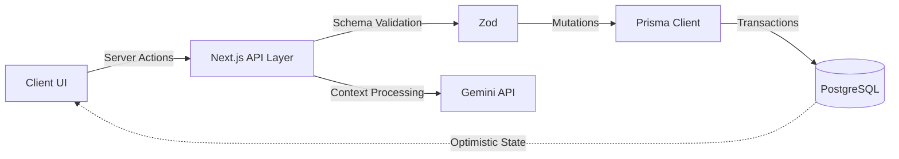

<div align="center">
  <br>
  <h1>A R C H O N</h1>
  <p>
    <b>Gamified Identity Construction Platform</b>
  </p>
  <p>
    <sub>
      Archon transforms abstract self-improvement into quantifiable progression by mapping daily habits and focus sessions to an immutable behavioral ledger.
    </sub>
  </p>
  <br>
  <p>
    
    
    
    
  </p>
  <br>
  <a href="#-project-overview">Project Overview</a> ✦
  <a href="#-key-features">Key Features</a> ✦
  <a href="#-system-architecture">System Architecture</a> ✦
  <a href="#-tech-stack">Tech Stack</a>
  <br>
</div>
<hr>

## ◈ Project Overview

Traditional productivity tools treat tasks as isolated, zero-sum events. When a list is completed, the metadata of the effort vanishes, leaving the user with a blank slate and zero compounding velocity. This structural amnesia breaks consistency loops and obscures long-term behavioral patterns.

Archon resolves this by mapping task completion to an immutable progression graph. By converting daily commitments, project milestones, and deep work intervals into structured state changes, developers construct a verifiable, persistent ledger of their cognitive output over time.

<br>

## ◈ Key Features

### Core Capabilities

| <kbd>01</kbd> Identity Engine | <kbd>02</kbd> Consistency Visualization |
| :--- | :--- |
| Maps completed actions to a unified XP graph, treating personal growth as stateful progression. | Renders historical effort via multi-axis heatmaps and confidence curves to surface behavioral gaps. |
| <kbd>03</kbd> Execution Pipelines | <kbd>04</kbd> Deep Work Telemetry |
| :--- | :--- |
| Structures complex work into active project timelines, modular sections, and atomic tasks. | Captures exact focus duration and context states through a dedicated, constraint-based timer. |

<br>

### Coming Soon

| Capability | Impact |
| :--- | :--- |
| **Telemetry History** | Exposes granular timeline queries of past focus sessions and XP transactions via dashboard graphs. |
| **LLM Inference Workflows** | Injects Gemini-powered context engines to auto-generate project structures and optimize descriptions. |

<br>

<details>
<summary><b>Implementation Comparison</b></summary>
<br>

| Domain | Traditional Setup | Our Approach |
| :--- | :--- | :--- |
| **Task Management** | Ephemeral checkboxes that permanently discard exertion data upon completion. | Immutable event ledgers that persist every task state change into a quantifiable progression model. |
| **Behavior Tracking** | Scattered habit trackers logically disconnected from actual cognitive output. | Unified relational graph binding habit streaks, deep work constraints, and daily non-negotiables. |

</details>
<br>

## ◈ System Architecture

Archon operates on a server-driven application topology utilizing the Next.js App Router for strict client/server boundary enforcement. State mutations originating from isolated React client views execute via Server Actions where payloads are sanitized against a Zod validation layer. Validated mutations hit a distributed Prisma client which persists telemetry and metric updates into an edge-optimized PostgreSQL instance via localized ACID transactions.



## ◈ Project Structure

```text
archon/
├── app/               # Next.js App Router and server configuration
├── components/        # Isolated, reusable React container views
├── lib/               # Core utility logic and progression algorithms
├── prisma/            # Database schema definitions and migration state
├── hooks/             # Custom React lifecycle and state bindings
├── inngest/           # Background job execution queues
└── public/            # Static assets and foundational scripts
```

## ◈ Installation

Prerequisites: Node.js >= 18.0.0, npm/pnpm, PostgreSQL database instance.

Initial Setup:

```bash
git clone https://github.com/Abhayanthk/Achron.git
cd achron
npm install
# Configure environment variables (.env)
npm run build
npm run start
```

## ◈ Usage Example

```typescript
import { trackCompletion, grantIdentityXP } from "@/lib/telemetry";

// Core mutation handler for habit execution
export async function executeHabitCycle(userId: string, habitId: string) {
  const result = await trackCompletion(userId, habitId);
  
  if (result.isValid) {
    await grantIdentityXP({
      userId,
      baseAmount: 150,
      multiplier: result.streakMultiplier,
      metricState: "CONSISTENCY_UPDATE"
    });
  }
}
```

## ◈ Tech Stack

| Domain | Technology | Implementation Objective |
| :--- | :--- | :--- |
| **Core Framework** | Next.js | Compiles full-stack routing, server-side execution, and API endpoints. |
| **Data Access** | Prisma | Enforces strict type safety and query formulation against the relational layer. |
| **Database** | PostgreSQL | Maintains referential graph integrity and transactional state persistence. |
| **Styling** | Tailwind CSS | Maps tokenized design constraints directly to atomic utility classes. |
| **Queue Execution** | Inngest | Offloads durable background pipelines and state updates without infrastructure bloat. |
