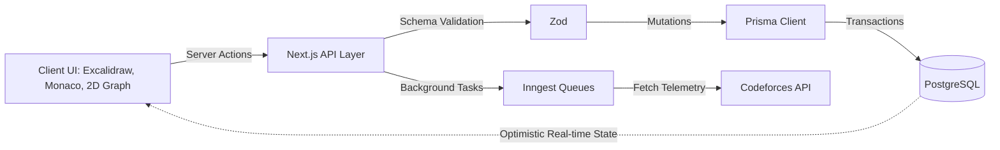

<div align="center">
  <br>
  <h1>A R C H O N</h1>
  <p>
    <b>Gamified Identity Construction Platform</b>
  </p>
  <p>
    <sub>
      Archon transforms abstract self-improvement into quantifiable progression by mapping algorithmic training, continuous learning, and focus sessions to an immutable behavioral ledger.
    </sub>
  </p>
  <br>
  <p>
    
    
    
    
  </p>
  <br>
  <p>
    <b>Live Link:</b> <a href="https://achron.vercel.app/logs">https://achron.vercel.app/logs</a>
  </p>
  <br>
  <a href="#-project-overview">Project Overview</a> ✦
  <a href="#-key-features">Key Features</a> ✦
  <a href="#-system-architecture">System Architecture</a> ✦
  <a href="#-tech-stack">Tech Stack</a>
  <br>
</div>
<hr>

## ◈ Project Overview

Traditional productivity tools treat tasks as isolated, zero-sum events. When a list is completed, the metadata of the effort vanishes, leaving the user with a blank slate and zero compounding velocity. This structural amnesia breaks consistency loops and obscures long-term behavioral patterns.

Archon resolves this by mapping task completion, deep work, and algorithmic training to an immutable progression graph. By converting daily commitments, complex competitive programming metrics, spatial notes, and project milestones into structured state changes, developers construct a verifiable, persistent ledger of their cognitive output over time.

<br>

## ◈ Key Features

### Core Capabilities

| <kbd>01</kbd> Relational Knowledge Base | <kbd>02</kbd> CP Analytics Engine |
| :--- | :--- |
| Escapes linear markdown via a 2D knowledge graph mapping note topologies. Fuses Notion-like BlockNote editing with embedded infinite Excalidraw whiteboards for spatial reasoning. | Ingests Codeforces telemetry to track competitive programming performance. Houses a Monaco-backed algorithm library with true Elo estimation routing via Inngest queues. |
| <kbd>03</kbd> Temporal Execution | <kbd>04</kbd> Stateful Identity Engine |
| :--- | :--- |
| Structures complex work into active project timelines via React Big Calendar. Enforces deep work constraints through a dedicated session timer capturing granular focus telemetry. | Translates habit streaks, daily logs, and non-negotiables into a unified XP paradigm. Renders historical exertion via 3D particle arrays, Recharts heatmaps, and leveling curves. |

<br>

### Coming Soon

| Capability | Impact |
| :--- | :--- |
| **LLM Graph Inference** | Injects Gemini-powered context engines to auto-generate node connections and synthesize semantic clusters inside the knowledge graph. |
| **Multi-Dimensional Querying** | Exposes granular timeline queries of past competitive programming sessions and algorithm state transitions via complex dashboard visualizers. |

<br>

<details>
<summary><b>Implementation Comparison</b></summary>
<br>

| Domain | Traditional Setup | Our Approach |
| :--- | :--- | :--- |
| **Note Taking** | Isolated linear text files lacking topological relationships. | Unified embedded graph connecting 3D models, Excalidraw canvases, and dynamic algorithm playbooks. |
| **Skill Tracking** | Ephemeral checkboxes that permanently discard exertion data. | Immutable event ledgers parsing Codeforces APIs to inject precise algorithmic Elo into a core identity graph. |

</details>
<br>

## ◈ System Architecture

Archon operates on a server-driven application topology utilizing the Next.js App Router for strict client/server boundary enforcement. State mutations originating from isolated Monaco editors or Excalidraw canvases execute via Server Actions where payloads are sanitized against Zod. Validated mutations hit a distributed Prisma client which persists telemetry into an edge-optimized PostgreSQL instance via ACID transactions. Background polling and CP metric algorithms offload non-blocking operations to an Inngest durable execution engine.



## ◈ Project Structure

```text
archon/
├── app/               # Next.js App Router housing CP Tracker, Notes, Dashboard
├── components/        # WebGL Particle/PixelBlast and React Graph views
├── lib/               # Core utility logic, CF Elo algorithms, schemas
├── prisma/            # Database schema definitions and migration state
├── hooks/             # Custom React lifecycle bindings and debouncers
├── inngest/           # Durable background queues and telemetry polling
└── public/            # Static assets and 3D dependency scripts
```

## ◈ Installation

Prerequisites: Node.js >= 18.0.0, npm, PostgreSQL database instance.

Initial Setup:

```bash
git clone https://github.com/Abhayanthk/Achron.git
cd achron
npm install
# Configure environment variables (.env) for Gemini, Database, Clerk Auth
npm run postinstall
npm run dev
```

## ◈ Usage Example

```typescript
import { inngest } from "@/inngest/client";
import { trackContestTelemetry } from "@/lib/cp-tracker";

// Asynchronous execution pipeline for evaluating an algorithm submission
export const processAlgorithmSubmission = inngest.createFunction(
  { id: "eval-cp-submission" },
  { event: "cp/submission.created" },
  async ({ event, step }) => {
    const verifiedStats = await step.run("fetch-codeforces-metrics", () => 
      trackContestTelemetry(event.data.userId, event.data.handle)
    );
    
    await step.run("update-identity-graph", () => 
      grantIdentityXP(event.data.userId, verifiedStats.eloDelta)
    );
  }
);
```

## ◈ Tech Stack

| Domain | Technology | Implementation Objective |
| :--- | :--- | :--- |
| **Interactive Canvas** | Excalidraw | Mounts an infinite coordinate whiteboard for zero-friction spatial ideation. |
| **Relational Graph** | Force Graph 2D | Visualizes epistemological connections across the user's note taxonomy via simulated physics. |
| **Algorithm Editor** | Monaco React | Supplies a VS Code parity environment for frictionless competitive programming tracking. |
| **Rich Typography** | BlockNote | Replicates Notion-style layout blocks backed by strict JSON document schemas. |
| **Data Visualization** | Recharts & Three.js | Orchestrates high-fidelity particle arrays and consistency heatmaps detailing performance. |
| **Identity Pipeline** | Inngest | Decouples complex Codeforces polling and level-up computations from the Vercel request lifecycle. |
| **Relational Core** | Prisma & PostgreSQL | Enforces transactional consistency across notes, graphs, habits, and user context. |
