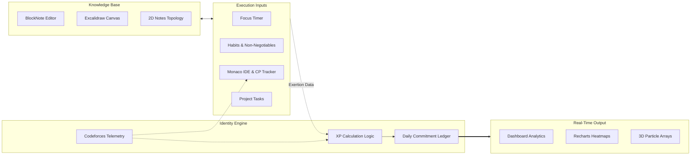

<div align="center">
  <br>
  <h1>A R C H O N</h1>
  <p>
    <b>Gamified Productivity & Identity Tracker</b>
  </p>
  <p>
    <sub>
      A unified workspace that combines block-based notes, 2D knowledge graphs, algorithm tracking, and deep work timers into a single system that converts your consistency into tangible progression.
    </sub>
  </p>
  <br>
  <p>
    
    
    
    
  </p>
  <br>
  <p>
    <b>Live Link:</b> <a href="https://achron.vercel.app">https://achron.vercel.app</a>
  </p>
  <br>
  <a href="#-project-overview">Project Overview</a> ✦
  <a href="#-key-features">Key Features</a> ✦
  <a href="#-system-architecture">System Architecture</a> ✦
  <a href="#-tech-stack">Tech Stack</a>
  <br>
</div>
<hr>

## ◈ Project Overview

Standard productivity apps separate your work from your progress. You take notes in one app, track habits in another, do deep work in a third, and practice competitive programming in complete isolation. This fragmentation makes it impossible to visualize your true daily output or maintain long-term momentum.

Archon resolves this by fusing every aspect of personal growth into a single Gamified Productivity ecosystem. Whether you are connecting thoughts in a 2D knowledge graph, sketching on an embedded Excalidraw canvas, crushing Codeforces metrics in the Monaco editor, or logging focus hours, every action feeds directly into your central Identity Engine. It translates your scattered efforts into cohesive analytics, 3D visualizations, and persistent XP graphs.

<br>

## ◈ Key Features

### Core Capabilities

| <kbd>01</kbd> Connected Knowledge Base | <kbd>02</kbd> CP Analytics & Editor |
| :--- | :--- |
| Ditch linear folders. Write rich, Notion-style documents with BlockNote, embed infinite Excalidraw whiteboards anywhere, and map relationships visually via a physics-based 2D force graph. | Practice algorithms within a dedicated Monaco VS Code editor environment. Sync directly with Codeforces data to track live performance, rating telemetry, and detailed problem history. |
| <kbd>03</kbd> Execution & Deep Work | <kbd>04</kbd> Gamified Dashboard |
| :--- | :--- |
| Manage complex project timelines via calendar views while executing atomic tasks. Activate a highly constrained focus timer to capture granular data on your deep work sessions. | Turn consistency into measurable growth. Translate habit streaks and daily logs into unified XP, rendered dynamically through comprehensive heatmaps and 3D particle analytics. |

<br>

### Coming Soon

| Capability | Impact |
| :--- | :--- |
| **AI-Powered Graph Inference** | Injects Gemini AI to automatically detect semantic relationships between your notes and auto-generate node connections inside the 2D knowledge base. |
| **Predictive Performance Analytics** | Exposes granular forecasting for competitive programming and productivity trends by referencing your historical effort and focus states. |

<br>

<details>
<summary><b>Implementation Comparison</b></summary>
<br>

| Domain | Traditional Setup | Our Approach |
| :--- | :--- | :--- |
| **Workspace Topology** | Tool fragmentation across separate calendars, notes, timers, and code editors. | A fully unified ecosystem where your algorithms, sketches, notes, and timers live inside one relational engine. |
| **Growth Metrics** | Habit trackers that offer simple checkboxes but discard context of your work. | An immutable Identity Engine that calculates complex parameters (Elo, focus time, streaks) into multi-axis progression graphs. |

</details>
<br>

## ◈ System Architecture

Archon connects traditionally isolated tools (notes, coding, timers, calendars) into a synchronized data stream. Execution inputs are captured across varied surfaces—from the rich text editor and excalidraw canvas to the CP practice area. These inputs are aggregated and verified before being fed into the core Identity Engine, which computes XP, adjusts leveling trajectories, and instantly cascades updates across your dashboard's heatmaps and 3D visualizers.



## ◈ Project Structure

```text
archon/
├── app/               # Main workspace, CP Tracker, Notes, Dashboard
├── components/        # Interactive Graph, Pixels, Editor wrappers
├── lib/               # Utility logic, Codeforces parsers, schemas
├── prisma/            # Relational database configurations
├── hooks/             # Custom state bindings for timers and UI
├── inngest/           # Background data synchronization jobs
└── public/            # Static assets and external dependencies
```

## ◈ Installation

Prerequisites: Node.js >= 18.0.0, npm, PostgreSQL database instance.

```bash
git clone https://github.com/Abhayanthk/Achron.git
cd achron
npm install
# Configure your .env variables (Database, Auth, Gemini)
npm run build
npm run start
```

## ◈ Tech Stack

| Domain | Technology | Implementation Objective |
| :--- | :--- | :--- |
| **Application Layer** | Next.js | Powers strict routing and highly optimized full-stack data fetching. |
| **Interactive Canvas** | Excalidraw | Mounts an infinite coordinate whiteboard for fluid spatial ideation. |
| **Relational Nodes** | Force Graph 2D | Visualizes the layout of user knowledge bases via simulated physics. |
| **Algorithm Sandbox** | Monaco Editor | Embeds a production-grade VS Code environment for frictionless coding. |
| **Rich Typography** | BlockNote | Replicates intuitive block-based document mapping. |
| **Data Visualization** | Recharts & Three.js | Orchestrates detailed capability heatmaps and dynamic 3D elements. |
| **Event Pipeline** | Inngest | Decouples intensive API polling and background calculations. |
| **Database** | PostgreSQL & Prisma | Enforces absolute integrity across notes, habits, projects, and progression data. |
